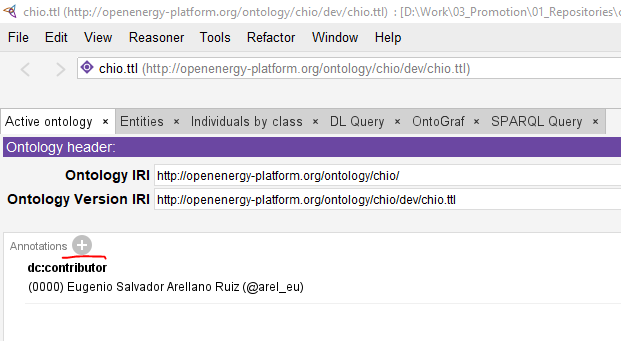
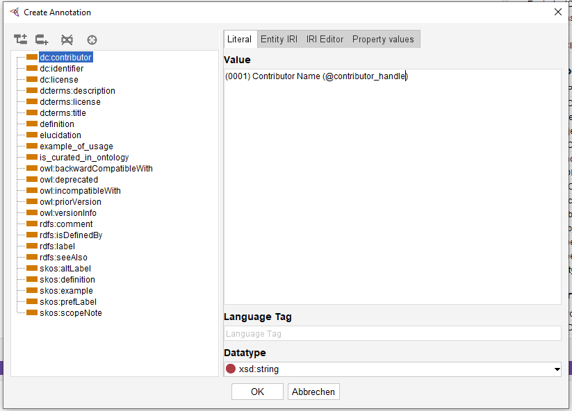
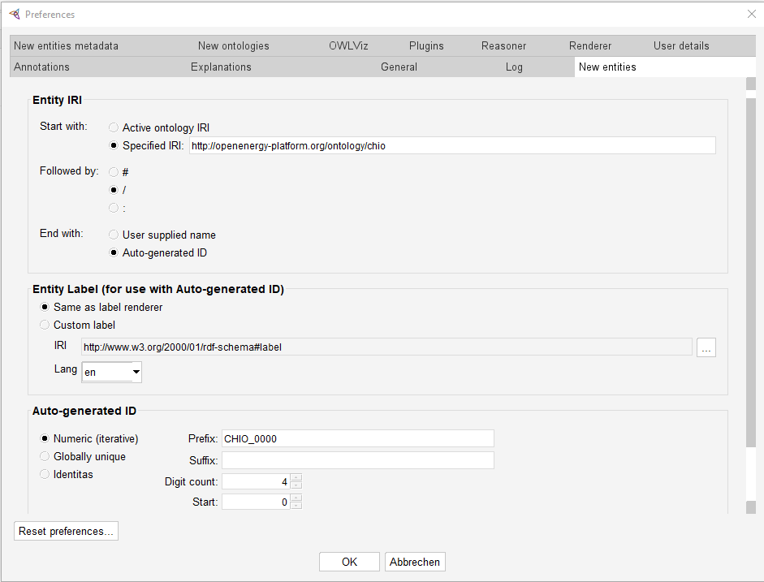

# Getting started

Ontology development can be done with multiple approaches. In our case we do a
method heavily inspired by the one used by the [Open Energy Ontology
(OEO)](https://github.com/OpenEnergyPlatform/ontology/wiki/).

## Dependencies

Before you can start working in the project you need to set up your development
environment. This page should list all the basic dependencies you need to get
started.

### 1. Python

A significant part of our work builds on the efforts coming from other ontology
projects, particularly the OEO and the [Basic Formal Ontology
(BFO)](https://github.com/BFO-ontology). This requires scripting which can vary
a lot with operating systems. To reduce the overhead from stepping in we
recommend using python whenever possible. Python is also used to build this
documentation using the incredible [MkDocs library](https://www.mkdocs.org/).
Python can be acquired in many ways, some examples might be their [official
site](https://www.python.org/), package managers like
[anaconda](https://www.anaconda.com/download) or app stores like the Microsoft
store. We suggest you install it your (or your company) preferred way.

### 2. Poetry

As previously mentioned, python can come from many sources. To make sure the
environments are as consistent as possible we suggest installing poetry using
the [official poetry installation
guide](https://python-poetry.org/docs/#installation).

### 3. Java platform

Most mature ontology development tools rely on the
[OWL API](https://github.com/owlcs/owlapi) which runs in the Java platform. To use most
of the software we need to work with ontologies you need to have a working Java
installation. Please refer to the installation instructions from
[OpenJDK](https://openjdk.org/).

!!! note

    There is an alternative API called
    [horned-owl](https://github.com/phillord/horned-owl) which is written in rust
    and can be made compatible with python. It is however still in development but
    we may have the chance in the future to move away from java into a pure python
    environment.

### 4. Protégé

[Protégé](https://protege.stanford.edu/) is basically the industry standard OWL
ontology development tool. You will be dealing with it 80% of the time so
please install it using the [official
channel](https://protege.stanford.edu/software.php#desktop-protege). We may
consider moving to [tawny-owl](https://github.com/phillord/tawny-owl) but since
it requires setting up Clojure, and we already add many dependencies we
postpone this. Also, the point and click pattern of Protégé, while not
efficient is easier to introduce to non-programmers.

### 4. Git

Cooperative development workflows require version control software. In this
project we rely on git. If you are not familiar with git please before you even
think about doing changes to the ontology. There is a lot of resources out
there, such as the [official git
tutorial](https://git-scm.com/docs/gittutorial). Git can be installed using
[the instructions in their official downloads
webpage](https://git-scm.com/downloads).


### 5. Linux system (Optional)

To properly compile the ontology one needs to use make which works properly
only in Linux and macOS. If you are working from a Windows system, either
enable the WSL or install a library like GnuWin. The compilation is not
necessary for development, but it must be always done before the release.

## Workspace

Once all the dependencies are installed clone the repository into a directory
of your preference using git.

```bash
git clone <repository-link>
```
Then change to the cloned directory, or open it with your favourite IDE and call
poetry by running:

```bash
poetry install
```

You can proceed to get the ROBOT dependency by calling the provided python script:

```bash
python scripts/get-robot.py
```
## Become a contributor

To become a contributor you have to create a new branch from dev.

```bash
git checkout -b new-contributor-<your handle>
```

Open Protégé and go to the **Active Ontology** tab, then click in the **+**
button next to annotations:



Pick the next consecutive number available and add your information with the
following format:

```
(XXXX) <name> (@<handle>)
```



Save the file and your changes should show in the rendered file, something like:

```
<http://purl.org/dc/elements/1.1/contributor> "(0000) Eugenio Salvador Arellano Ruiz (@arel_eu)" ,
                                            "(0001) Contributor Name (@contributor_handle)" .
```

Add the changes with git:

```bash
git add src/chio.ttl
```

And then push making a new branch in gitlab:

```bash
git push --set-upstream origin new-contributor-<your handle>
```

At last create a merge request, and we will review your submission.

## Protégé settings

Go to **File>Preferences...** and search for the **New Entities** tab and
configure it as follows:



!!! info "User unique ID"

    Make sure that you use your unique user ID in the Prefix like CHIO_**XXXX**
    where XXXX is your ID.
